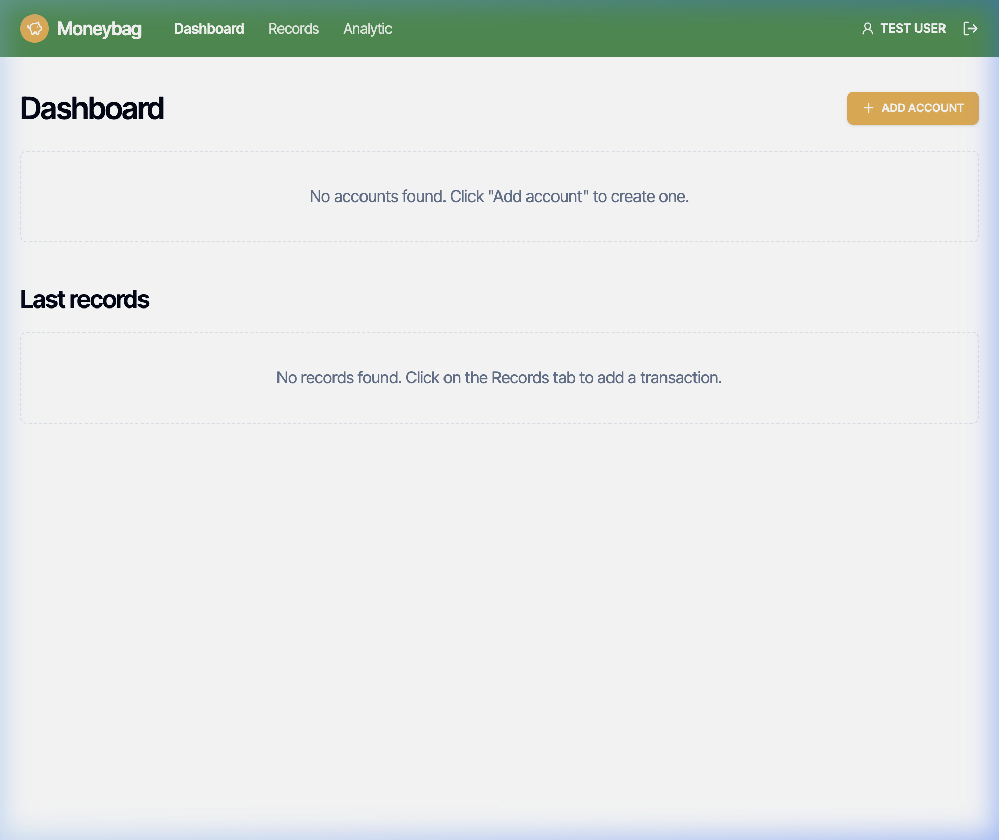
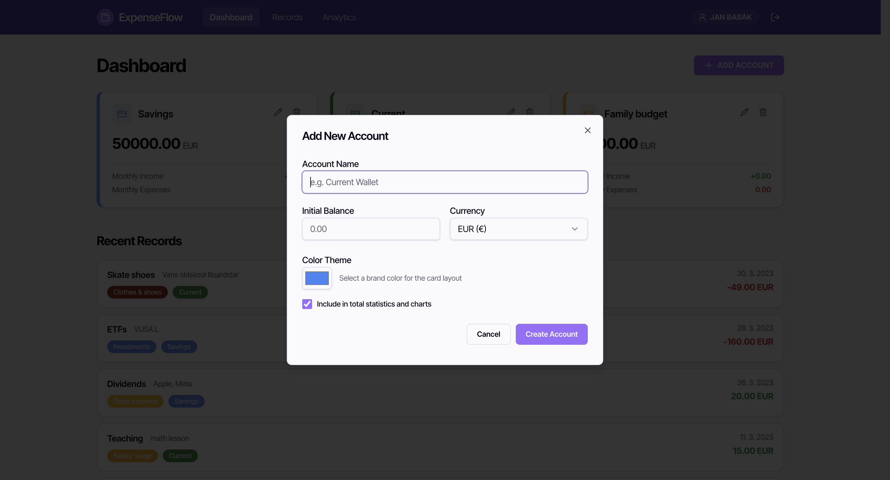
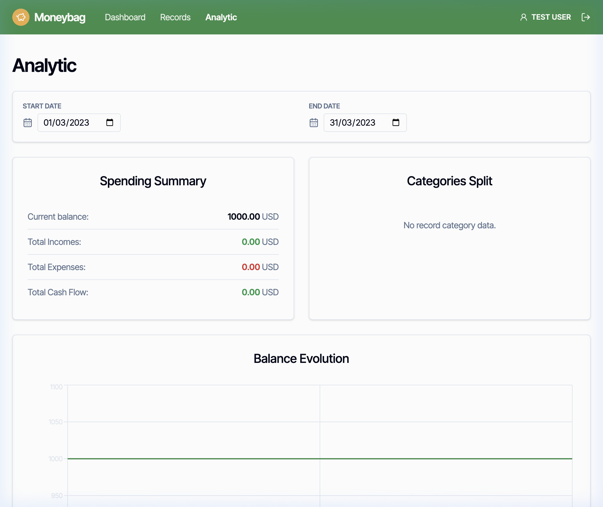
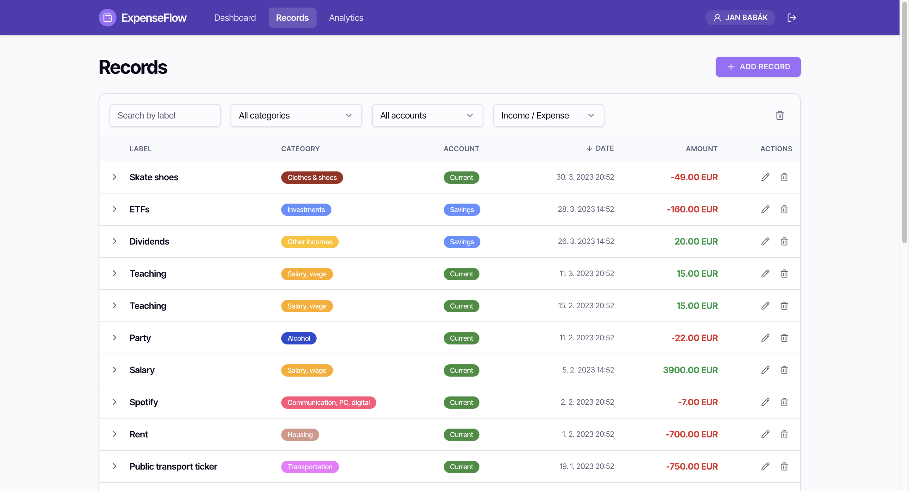
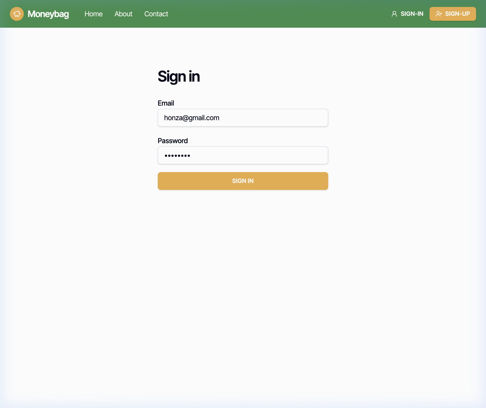
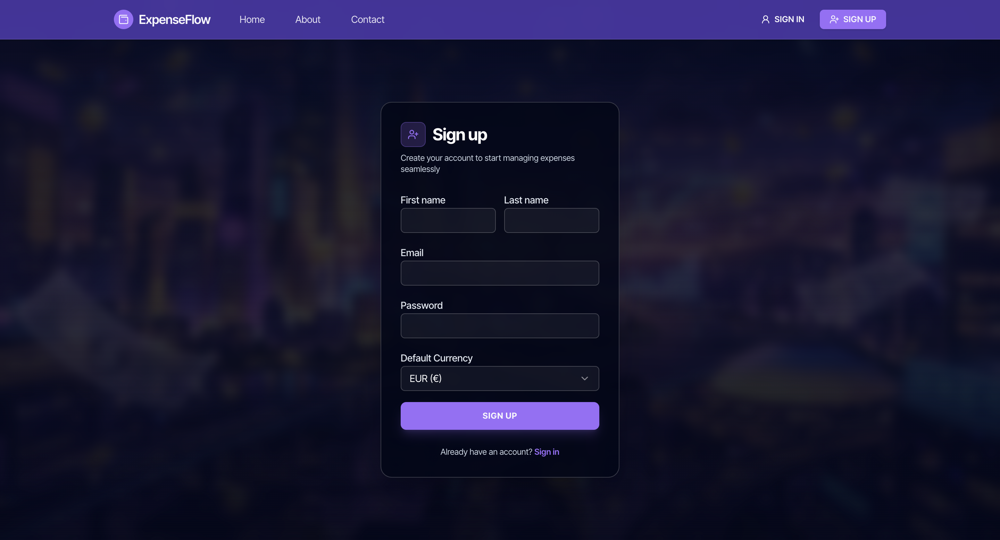

# ExpenseFlow 💸

ExpenseFlow is a modern, full-stack personal finance and expense tracking web application. It combines a robust **Spring Boot 3** REST API backend with a responsive **React 19 / Vite** frontend powered by TanStack Start, Tailwind CSS, and Recharts.

[](https://frontend-production-ae7e.up.railway.app)
[](https://backend-production-78678.up.railway.app/api/)
[](LICENSE)

---

## 🌐 Live Deployment

- **Frontend App:** [https://frontend-production-ae7e.up.railway.app](https://frontend-production-ae7e.up.railway.app)
- **Backend API:** [https://backend-production-78678.up.railway.app/api/](https://backend-production-78678.up.railway.app/api/)
- **Swagger Documentation:** [https://backend-production-78678.up.railway.app/api/swagger-ui/index.html](https://backend-production-78678.up.railway.app/api/swagger-ui/index.html)

---

## 📸 Screenshots

### 🌟 Landing Page


### 📊 Dashboard & Overview


### 💳 Account Creation & Configuration


### 📈 Financial Analytics & Visual Trends


### 📝 Transactions & Records Tracking


### 🔐 Secure Authentication Flow
| Sign In | Sign Up |
| :---: | :---: |
|  |  |


---

## 🌟 Features

- **🔐 Secure Authentication:** JWT-based stateless authentication with role-based access control (Admin / User).
- **💳 Multi-Account Management:** Manage multiple accounts (Checking, Savings, Cash, Investments) with custom colors, icons, and currencies.
- **📊 Interactive Analytics:**
  - Real-time balance evolution charts powered by Recharts.
  - Expense and income breakdowns by category (Food, Housing, Salary, Investments, etc.).
  - Total cashflow and balance metrics across accounts.
- **📝 Record Tracking & Filtering:**
  - Fast expense and income entry with amounts, notes, labels, and timestamps.
  - Multi-criteria filtering by label, account, category, and date ranges.
  - Server-side pagination and sorting.
- **📖 OpenAPI / Swagger Docs:** Interactive API exploration and testing at `/api/swagger-ui/index.html`.

---

## 🏗️ Tech Stack & Architecture

### **Backend (`/Backend`)**
- **Framework:** Spring Boot 3
- **Language:** Java 17+ (compatible with Java 21)
- **Security:** Spring Security & JSON Web Tokens (JJWT)
- **Persistence:** Spring Data JPA / Hibernate
- **Database:**
  - In-memory **H2 Database** for local development & testing
  - **MySQL** for cloud deployment / production
- **API Specs:** SpringDoc OpenAPI 3 / Swagger UI
- **Testing:** JUnit 5, Mockito, AssertJ, Spring Security Test

### **Frontend (`/Frontend`)**
- **Framework:** React 19 + TypeScript + Vite
- **Routing & State:** TanStack Start / TanStack Router & TanStack Query
- **Styling:** Tailwind CSS + Radix UI / Shadcn UI components + Lucide Icons
- **Visualizations:** Recharts data visualization library

---

## 📂 Repository Structure

```
ExpenseFlow/
├── Backend/                 # Spring Boot REST API
│   ├── src/                 # Java source code and test files
│   ├── pom.xml              # Maven dependencies and build configuration
│   ├── mvnw / mvnw.cmd      # Maven wrapper executables
│   ├── Dockerfile           # Multi-stage production container
│   └── railway.json         # Railway deployment config
├── Frontend/                # React + Vite web client
│   ├── src/                 # React components, routes, and API client
│   ├── public/              # Static assets
│   ├── package.json         # Node.js dependencies and scripts
│   └── vite.config.ts       # Vite & dev proxy configuration
├── screenshots/             # Application UI screenshots
├── .gitignore               # Comprehensive monorepo gitignore
└── README.md                # Project documentation
```

---

## 🚀 Getting Started

### Prerequisites
- **Java JDK 17+** (or Java 21)
- **Node.js 18+** and **npm** (or Bun / pnpm)

---

### 1. Start the Backend API

```bash
cd Backend

# Run tests
./mvnw clean test

# Start the Spring Boot server (runs on http://localhost:8000)
./mvnw spring-boot:run
```

- Backend API Base URL: `http://localhost:8000/api`
- Swagger UI Documentation: [http://localhost:8000/api/swagger-ui/index.html](http://localhost:8000/api/swagger-ui/index.html)
- H2 Database Console: [http://localhost:8000/api/h2-console](http://localhost:8000/api/h2-console) (JDBC URL: `jdbc:h2:mem:expenseflow`)

---

### 2. Start the Frontend Client

In a new terminal window:

```bash
cd Frontend

# Install dependencies
npm install

# Start Vite development server (proxies /api to http://localhost:8000)
npm run dev
```

Open [http://localhost:5173](http://localhost:5173) in your browser.

---

## 🧪 Demo Credentials

The backend comes pre-seeded with sample data for demonstration:

| Email | Password | Role | Currency |
| :--- | :--- | :--- | :--- |
| `honza@gmail.com` | `12345678` | USER | EUR |
| `matej@gmail.com` | `12345678` | USER | CZK |
| `admin@gmail.com` | `12345678` | ADMIN | EUR |

*(You can also register a new account from the Sign Up page at any time).*

---

## 🛠️ Production Build & Verification

```bash
# Build Backend JAR
cd Backend
./mvnw clean package

# Build Frontend Bundle
cd ../Frontend
npm run build
```

---

## 📄 License

This project is open source and available under the [MIT License](LICENSE).
